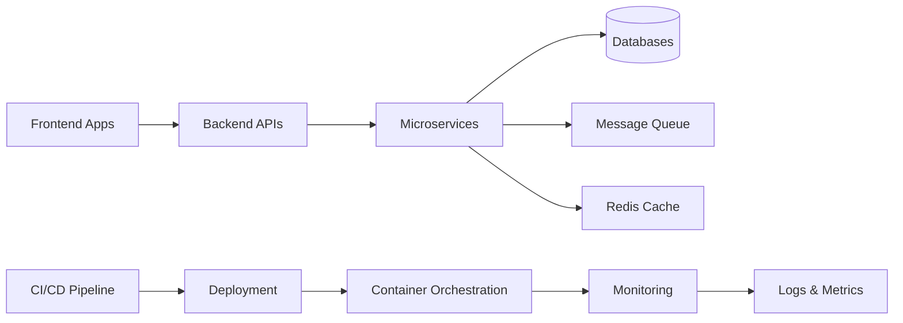
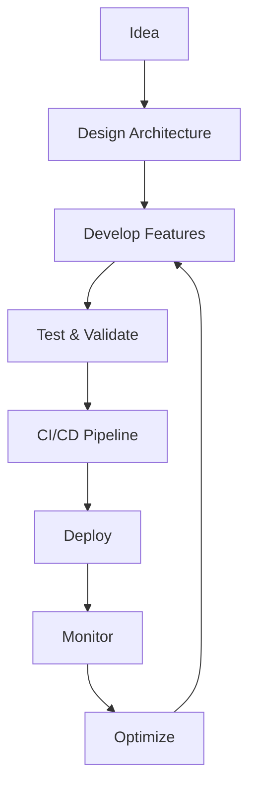
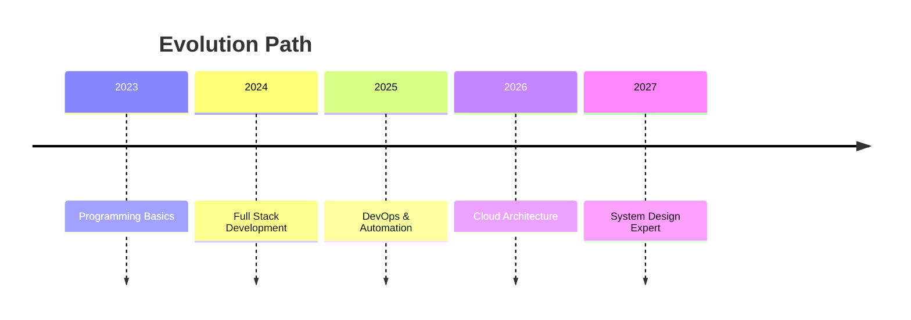

<div align="center">


<h1>⚡ ENGINEERING SYSTEM PROFILE</h1>


<br/>

<a href="https://momonaim.netlify.app"></a> <a href="https://github.com/momonaim/projects"></a> <a href="mailto:momonaim01@gmail.com"></a>

</div>

---

# 🧠 SYSTEM IDENTITY

```bash
$ load_profile.sh

Name        : Abdelmounim MOUADILI
Role        : Computer Engineering Student
Speciality  : Full-Stack + DevOps + Cloud Systems
Philosophy  : "Automate everything. Scale everything."
Status      : Building production-grade architectures
```

---

# 🧬 CORE ENGINEERING DNA

```yaml
architecture_mindset:
  - Microservices-first design
  - API-driven systems
  - Infrastructure as Code
  - CI/CD automation pipelines

engineering_values:
  - scalability
  - maintainability
  - observability
  - performance

dev_style:
  - clean code
  - modular design
  - real-world deployment focus
```

---

# ⚙️ FULL SYSTEM ARCHITECTURE (HOW I THINK)



---

# 🚀 ACTIVE DEVELOPMENT ZONE

```yaml
current_focus:
  - Cloud Native Microservices
  - Kubernetes & K3s
  - GitOps (ArgoCD)
  - CI/CD Automation (Jenkins)
  - Infrastructure Provisioning (Terraform + Packer)

building:
  - scalable backend systems
  - distributed architectures
  - automated deployment pipelines
```

---


# 🛠️ TECH STACK MATRIX

## 🎯 FRONTEND

```txt
HTML • CSS • JavaScript
React • Angular • Vue
Tailwind • Bootstrap • Figma
```

## ⚙️ BACKEND

```txt
Spring Boot • Node.js • Express
Java • PHP • C/C++
```

## ☁️ DEVOPS

```txt
Docker • Jenkins • GitHub Actions
Terraform • Ansible • Packer
Linux • Bash
```

## 🗄️ DATABASES

```txt
MySQL • PostgreSQL • MongoDB
SQLite • Redis
Oracle DB • MS SQL Server
```

## 📱 MOBILE & OTHER

```txt
Flutter
```

---

# 🧠 ENGINEERING WORKFLOW



---

# 📊 PERFORMANCE DASHBOARD

<div align="center">


<br/>


</div>

---

# 🧭 ENGINEERING ROADMAP



---

# 🧪 EXPERIMENTAL LAB

```yaml
lab_projects:
  - Kubernetes cluster (K3s)
  - CI/CD pipelines with Jenkins
  - GitOps with ArgoCD
  - Microservices with Spring Boot
  - Infrastructure automation with Terraform
```

---

# 🛰️ LIVE SYSTEM STATUS (SIMULATION)

```bash
$ system_status

Frontend        : ONLINE
Backend         : ONLINE
CI/CD           : ACTIVE
Infrastructure  : STABLE
Monitoring      : RUNNING
```

---

# 🧠 PROBLEM-SOLVING APPROACH

```txt
1. Understand system constraints
2. Design scalable architecture
3. Implement modular components
4. Automate deployment
5. Monitor and optimize
```

---

# 🤝 CONNECT

<div align="center">

<a href="https://linkedin.com/in/abdelmounim-mouadili-6bb946283">

</a>

<a href="https://wa.me/212652182486">

</a>

<a href="mailto:momonaim01@gmail.com">

</a>

</div>

---

# ⚡ FINAL SYSTEM CALL

```bash
$ execute_future.sh

> Building scalable systems...
> Automating infrastructure...
> Engineering the future...
```

---

<p align="center">

</p>

</div>
